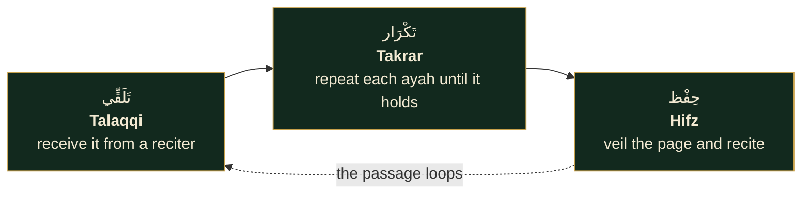
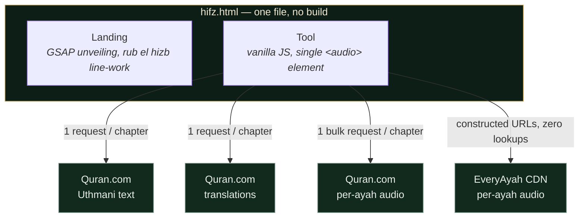

# Hifz Repeater

**A single-file web tool for Quran memorisation — built on the method used for fourteen centuries.**

Hear it from a reciter · Repeat it until it settles · Veil the page and recite

<br>


<br>


</div>

<br>

## ✦ The idea in one image

The page stays in front of you. The ink does not.

<div align="center">

</div>

One tap blurs every ayah so you can recite from memory. Stuck on a single verse? **Tap it to peek** — only that one sharpens, the way a teacher lets a student glance at one word, never the whole page. Tap again and the veil returns.

<br>

## ✦ The method

Nothing new. That is the point.



| | Mode | What it does |
|---|---|---|
| 🎧 | **Read through** | Plays the passage ayah by ayah, start to finish — the classic *sabaq* listening pass |
| 🔁 | **Repeat ×3 / ×5 / ×7 / ×10** | Drills one ayah on a loop before advancing to the next |
| ♾ | **Loop the passage** | Restarts the whole range when it ends — combine with either mode |
| 👆 | **Veil & peek** | Blur everything; reveal one ayah at a time, on your terms |
| ⏸ | **Pause between ayat** | Zero by default. Raise it when you want a breath to recite along |
| ⏭ | **Roll into the next surah** | Finish a surah and the next one loads and keeps playing |

<br>

## ✦ Seamless by default

Recitation flows **without a gap between ayat**. Ayah *n+1* is fetched, decoded and
scheduled on the audio clock before ayah *n* finishes, so it begins at exactly the
sample where the previous one ends.

| Layer | When it runs | What you get |
|---|---|---|
| **Gapless** | The audio host allows the page to read its bytes (Quran.com, EveryAyah) | Web Audio scheduling — sample-accurate, zero dead air |
| **Buffered** | The host refuses CORS, so the bytes can't be decoded here | Two `<audio>` elements ping-pong; the next ayah is fully preloaded and handed over on `ended` |
| **Continuous** | Reciters published as one take per surah | The surah streams unbroken from start to finish |

The player shows which layer is active. Measured in a headless browser against a
600 ms clip: consecutive ayat start **588 ms and 602 ms** apart — no gap. Set the
pause slider to 1 s and the same measurement reads **1609 ms**, so the silence is
yours to choose, never an artefact.

<br>

## ✦ The page itself

Exact **Uthmani mushaf script**, served live from the Quran.com API, set in a Quranic typeface on a parchment page — with the ayah currently being recited highlighted in gold.

<div align="center">
<table>
<tr>
<td align="center" width="50%">
<br>
<sub><b>Arabic only</b> — flowing mushaf layout</sub>
</td>
<td align="center" width="50%">
<br>
<sub><b>With translation</b> — veiled along with the Arabic</sub>
</td>
</tr>
</table>
</div>

<br>

## ✦ Built for the phone in your hand

Memorisation happens before Fajr, on commutes, between things — so the whole experience is mobile-first: stacked controls, thumb-sized targets, a sticky player that follows you down the page.

<div align="center">
<table>
<tr>
<td align="center"></td>
<td align="center"></td>
</tr>
</table>
</div>

<br>

## ✦ Fourteen reciters, four translations

| Classical / Teaching | Source | Contemporary | Source |
|---|---|---|---|
| Mahmoud Khalil al-Husary | Quran.com | Mishari Rashid al-Afasy | Quran.com |
| Husary — **Mu'allim** *(teaching pace)* | Quran.com | Saud ash-Shuraym | Quran.com |
| AbdulBaset AbdulSamad (Murattal) | Quran.com | Abdur-Rahman as-Sudais | Quran.com |
| Mohamed Siddiq al-Minshawi | Quran.com | Maher al-Muaiqly | EveryAyah |
| Abu Bakr al-Shatri | Quran.com | Saad al-Ghamdi | EveryAyah |
| Muhammad Ayyoub | EveryAyah | Yasser al-Dossari | EveryAyah |
| | | Abdullah al-Juhany | EveryAyah |

| Continuous — full surah, one take | Source |
|---|---|
| **Sheikh Yusuf Aidroose** · يوسف العيدروس | MP3Quran |

Aidroose is published as one recording per surah rather than ayah by ayah, so he
plays as a single unbroken take. The page, the veil and the translation all still
work; per-ayah repeats and verse highlighting need an ayah-by-ayah voice, and the
player says so rather than silently doing nothing.

**Translations:** Saheeh International · M.A.S. Abdel Haleem · Al-Hilali & Khan · T. Usmani — shown beneath each ayah and veiled with it, so the English can't quietly do your recall for you.


<br>

## ✦ Quick start

```
1. Open hifz.html in any browser          (double-click, or host it anywhere)
2. Tap "Open the tool"
3. Pick a surah · set the ayah range · or tick ☑ Whole surah
4. Choose a reciter and (optionally) a translation → Load passage
5. Press ▶ Play — set the mode and loop in the player bar
6. When the sound is familiar: Hide → recite → peek only where stuck
```

**A suggested session:** *read through + loop* a few cycles while following the text → switch to *repeat ×5* and recite along → **Hide** and recite from memory.

<br>

## ✦ How it works



- **Bulk audio resolution.** Quran.com reciters resolve through `recitations/{id}/by_chapter/{n}?per_page=300` — one request even for Al-Baqarah. Measured result: **all 286 ayat, with translation, loaded in 1.3 s**.
- **EveryAyah needs no lookup at all** — URLs follow `everyayah.com/data/{folder}/{SSS}{AAA}.mp3`.
- **Resilient playback.** A broken MP3 mid-session skips to the next ayah instead of stalling.
- **Bounded memory.** Decoded PCM is far larger than the MP3 it came from, so the
  gapless engine keeps a rolling window of ~14 buffers around the cursor. Al-Baqarah
  streams the same as Al-Fātiḥah.
- **MP3Quran hosts are discovered, not hardcoded.** MP3Quran shards reciters across
  numbered servers and moves them, so the app asks its API first and, if that is
  unreachable, races every plausible host × folder spelling in parallel and keeps
  whichever answers. The result is cached in `localStorage`.
- **Adding a reciter is one line** — a new `<option>` in the reciter select:

```html
<option value="q:6">…</option>                      <!-- q:{recitation_id}  → Quran.com, per ayah -->
<option value="e:Ghamadi_40kbps">…</option>          <!-- e:{folder_name}    → EveryAyah, per ayah -->
<option value="m:yosf-laaydros">…</option>           <!-- m:{slug}           → MP3Quran, whole surah -->
```

- **Motion that knows when to stop.** GSAP + ScrollTrigger drive the landing's blur-to-sharp "unveiling" language; `prefers-reduced-motion` disables all of it and the page remains fully usable.
- **Fonts:** Amiri Quran (Arabic) · Fraunces + Figtree (Latin), via Google Fonts.

<br>

## ✦ Hosting

It is one file. Any static host works.

| Host | How |
|---|---|
| **GitHub Pages** | Push, enable Pages, done |
| **Netlify / Vercel / Cloudflare** | Drag and drop |
| **Locally** | Just open the file *(internet still required — text and audio are fetched live)* |

Rename to `index.html` to serve it at the root of a domain.

<br>

## ✦ Keyboard

| | |
|---|---|
| <kbd>Space</kbd> | Play / pause |
| <kbd>←</kbd> <kbd>→</kbd> | Previous / next ayah |
| <kbd>V</kbd> | Veil the page |
| <kbd>T</kbd> | Tajwīd colouring |
| <kbd>L</kbd> | Loop the passage |
| <kbd>?</kbd> | Help sheet |

Plus lock-screen controls via the Media Session API, and a screen wake lock so the
phone doesn't sleep mid-session.

<br>

## ✦ Known limitations & roadmap

- **Works offline once visited.** The service worker caches the app shell and every
  passage you have loaded. *(Until now it never actually installed — the file was
  saved as `sw .js`, with a space, while the page registered `sw.js`. Fixed.)*
- **First play needs a tap** — mobile browsers block autoplay; the tool surfaces a clear message when it happens.
- **Progress is local and private.** Streak, repeats and days practised live in
  `localStorage` on your device. There is no account and nothing is uploaded — your
  memorisation log stays with you and your teacher.
- **Continuous reciters have no verse timings**, so the highlight can't follow them.
  Per-ayah timing data would be needed to change that.

<br>

## ✦ Archive

Every previous build is kept in [`Archive/`](Archive/), including
`index-v2.03-pre-seamless.html` — the exact version from before this update. To roll
back: `cp "Archive/index-v2.03-pre-seamless.html" index.html`.

<br>

---

<div align="center">

Quranic text and recitations served live by **[Quran.com](https://quran.com)**, **[EveryAyah.com](https://everyayah.com)** and **[MP3Quran.net](https://mp3quran.net)**

*Built as a study aid — your teacher remains your teacher.*

<sub>﴿ فَلَقَدْ يَسَّرْنَا الْقُرْآنَ لِلذِّكْرِ فَهَلْ مِن مُّدَّكِرٍ ﴾</sub>

</div>
